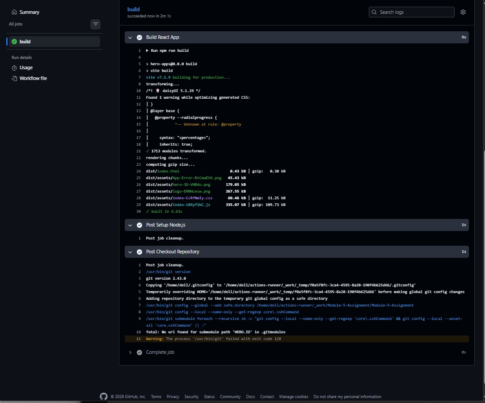

````md
# Module 5 Assignment

# GitHub Actions Fundamentals

## Project Overview

This project demonstrates a simple CI pipeline using GitHub Actions with a
self-hosted runner for a React/Vite application.

The pipeline automatically runs whenever code is pushed to the `development`
branch.

The workflow installs dependencies and builds the project automatically.

---

# Technologies Used

- React
- Vite
- GitHub Actions
- Self-hosted Runner
- Node.js

---

# Repository Link

```bash
https://github.com/auladwd/Module-5-Assignment
```
````

---

# Workflow File Location

```bash
.github/workflows/ci.yml
```

---

# Workflow YAML File

```yaml
name: CI Pipeline

on:
  push:
    branches:
      - development

jobs:
  build:
    runs-on: self-hosted

    steps:
      - name: Checkout Code
        uses: actions/checkout@v4

      - name: Setup Node.js
        uses: actions/setup-node@v4
        with:
          node-version: 20

      - name: Install Dependencies
        run: npm install

      - name: Build Project
        run: npm run build
```

---

# CI/CD Explanation

## What is CI/CD?

CI/CD is an automation process used in software development.

### CI (Continuous Integration)

Continuous Integration automatically:

- Builds code
- Tests code
- Validates code

whenever developers push changes to the repository.

### CD (Continuous Delivery/Deployment)

Continuous Delivery prepares the application for deployment after successful
build and testing.

---

# Benefits of CI/CD

- Faster development process
- Reduced human error
- Automatic testing and building
- Faster bug detection
- Improved software quality

---

# Self-Hosted Runner Explanation

## What is a Self-Hosted Runner?

A self-hosted runner is a machine owned and managed by the developer where
GitHub Actions workflows are executed.

In this project, Ubuntu/WSL machine was configured as a self-hosted runner.

---

# Advantages of Self-Hosted Runner

- Full control over the environment
- Can install custom software
- Local machine execution
- Better flexibility

---

# Workflow Execution Process

```text
Developer Pushes Code
        ↓
GitHub Detects Workflow
        ↓
Workflow Triggered
        ↓
Self-hosted Runner Receives Job
        ↓
npm install Executes
        ↓
npm run build Executes
        ↓
Build Success or Failure Result Generated
```

---

## Step — Run Self-hosted Runner

```bash
cd ~/actions-runner
./run.sh
```

---

# Pipeline Success Screenshot

Add screenshot here:

```text
successful-pipeline.png
```

Example:

```md

```

---

# Pipeline Failure Debugging Screenshot

Add screenshot here:

```text
failed-pipeline-debugging.png
```

Example:

```md

```

---

# How Pipeline Failure Was Created

To demonstrate debugging:

`package.json` build script was intentionally changed from:

```json
"build": "vite build"
```

to:

```json
"build": "vite build-error"
```

This caused the GitHub Actions workflow to fail.

After taking the failure screenshot, the build script was corrected again.

---

# Commands Used

## Create Workflow Folder

```bash
mkdir -p .github/workflows
```

---

## Create Workflow File

```bash
touch .github/workflows/ci.yml
```

---

## Push Changes

```bash
git add .
git commit -m "Added GitHub Actions workflow"
git push origin development
```

---

# Expected Outcome

After completing this assignment:

- The workflow runs automatically on push
- Self-hosted runner executes the workflow
- React/Vite application builds successfully
- Pipeline failures can be debugged from logs

---

# Conclusion

This assignment helped to understand:

- CI/CD concepts
- GitHub Actions workflow structure
- Self-hosted runners
- Automated build process
- Pipeline debugging techniques

```

```
